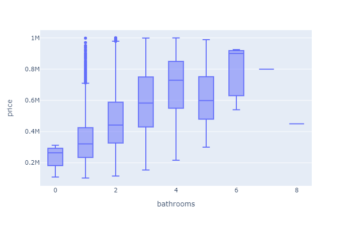

# Predictions for King County Houses

For this project, I will use regression modeling to analyze house sales in King County and predict prices for other homes in that area. With my model, we can analyze different variables and see which one has the largest impact on the price.
This sort of model could be used to help real estate agents, clients, and investors take advantage of opportunities to sell, upgrade, or buy homes.

# Data

The dataset can be found at 'kc_house_data.csv'. It containes 21 variables and 21k transactions. It was fairly cleaned with a few missing/unrecognizable values. Columns descriptions: 
* id - unique identifier for a house
* dateDate - house was sold
* pricePrice - is prediction target
* bedroomsNumber - of Bedrooms/House
* bathroomsNumber - of bathrooms/bedrooms
* sqft_livingsquare - footage of the home
* sqft_lotsquare - footage of the lot
* floorsTotal - floors (levels) in house
* waterfront - House which has a view to a waterfront
* view - Quality of view
* condition - How good the condition is ( Overall )
* grade - overall grade given to the housing unit, based on King County grading system
* sqft_above - square footage of house apart from basement
* sqft_basement - square footage of the basement
* yr_built - Built Year
* yr_renovated - Year when house was renovated
* zipcode - zip
* lat - Latitude coordinate
* long - Longitude coordinate
* sqft_living15 - The square footage of interior housing living space for the nearest 15 neighbors
* sqft_lot15 - The square footage of the land lots of the nearest 15 neighbors

I also added data with the cities in King County from 'uszips.csv' which can be found in this repository. I used 24 cities which cut down the quantity of zipcodes I had to deal with.

# Key Findings

**Which area has the most/least expensive houses?**

Here the graph is showing the least to most expensive cities to live by the median pricing of houses in the area. So even though some cities have high prices, you can still find a good deal if you're on a budget.

**Does the grading system have a significant impact on pricing?**

Above you can see the grading scale King County uses for their system. Below you can see the pricing on houses with a certain grade. It seems to have a positive relationship with prices. So if you're in the market to sell it's best to try to get a grade 9 or better. For example, going from grade 8 to grade 9 can increase your profits by at least 100K(comaparing the medians).

**How does adding bathrooms affect the pricing of houses?**

So adding bathrooms can increase the amount you pay for your new home. Make sense, since it adds to the size of the home. Above shows the scale steadily going up until you get to around 5. Below you can see the increase in price as you move from 1 to 4 bathrooms. So the best bet you be upgrading from either 2(b2) to 3(b3), or 3 to 4(b4) bathrooms, for the smallest increase in price.

# Recommendations:
1. Buy a house with a grade no lower than 6. Over time, do some renovations to get it up to at least a grade 9 for potential selling bonus.
2. Narrow down to the top five cities within your budget. Even the cities with more expensive houses, aside from Medina, meets up with the average prices for houses sold in King County.
3. Looking to add extra rooms, the best bang for your buck is moving from 2 bathrooms to 3, or 3 bathrooms to 4. 
